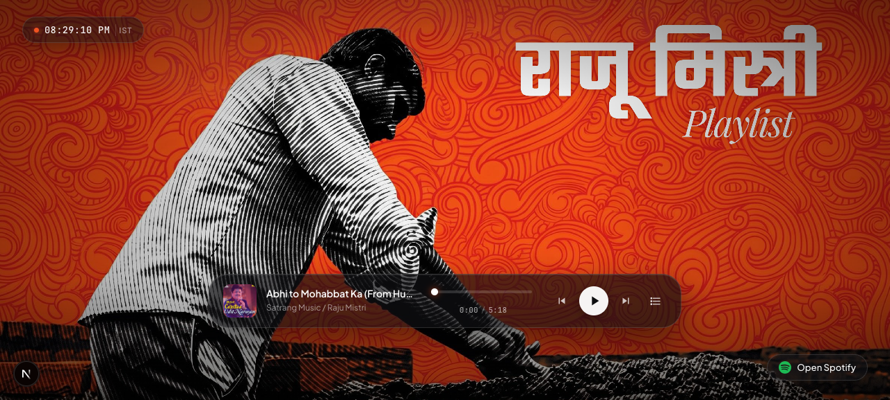
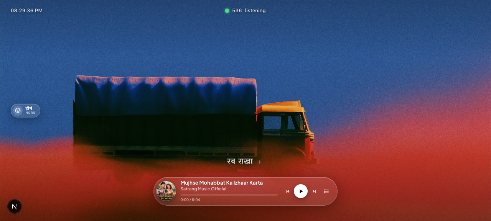

# Raju Mistri Playlist 🎵

A dual-theme interactive music player built with Next.js. Features a glass-pill player (Raju Mistri) with 14 MP3 tracks and a truck-themed player (Truck Wala) with 44 YouTube tracks.

## Screenshots

### Raju Mistri


### Truck Wala


## Features

- 🎨 Two themes — Raju Mistri (glass-pill) & Truck Wala (truck disc)
- 🔄 Switch themes with double Tab or triple-tap on touch
- 🎺 Horn button on Truck Wala (with audio!)
- 📱 Responsive, touch-friendly
- ▶️ Full player controls (play/pause, seek, prev/next)
- 📋 Playlist drawer with track selection
- 🕐 IST clock
- 🎧 Spotify playlist link (Raju Mistri)

## Tech Stack

- Next.js 16 + React 19
- TypeScript
- Tailwind CSS v4

## Getting Started

```bash
pnpm install
pnpm dev
```

Open [http://localhost:3000](http://localhost:3000).
